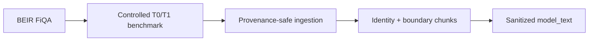
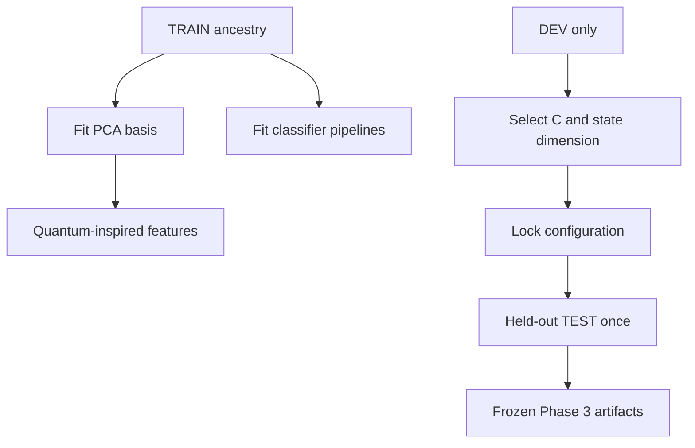
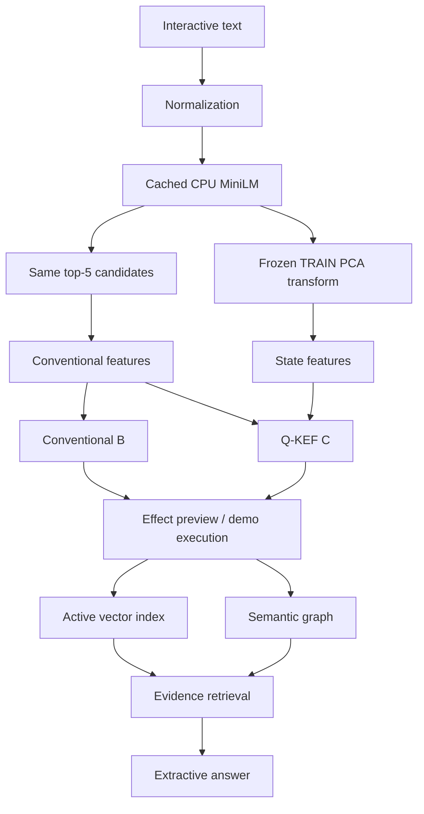

# Final System Architecture

## Data and preprocessing

## Training and frozen evaluation

DEV and TEST are transformed by the frozen TRAIN PCA. Ground truth is never a runtime feature.

## Runtime and application

`FinalArtifactLoader` verifies repository-trusted artifacts. `run_final_analysis.py` reads predictions without training. Streamlit caches immutable resources while mutable demo state remains per session.
